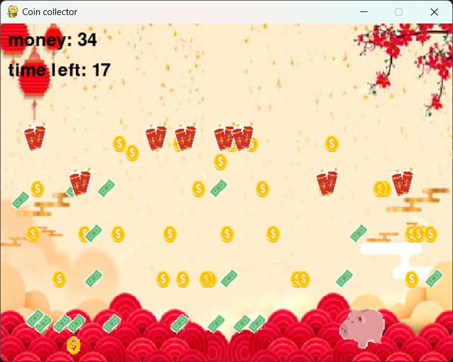

# Coin Collector

- A simple object-catching game. The goal is to collect as much money as possible before time is up!

## Features
- Object catching
- Time-limited gameplay
- Special item to collect
- Obstacle to avoid

## Installation
1. Clone this repository:
```
git clone https://github.com/Frank474747/Coin-Collector
```
2. Navigate into this directory
```
cd Coin-Collector
```
3. Install dependencies
```
pip install pygame-ce
```
4. Run the game
```
python main.py
```

## How to Play
- Move the piggy **left** and **right** using arrow keys 
- Collect **Coins** and **Banknotes** to earn money
- Avoid **Firecrackers** that reduce your money
- Catch **Lucky Bags** that brings a wave of coins and banknotes but also a few firecrackers
- Try to collect as much money as possible!

## Screenshots
&nbsp;&nbsp;&nbsp;
